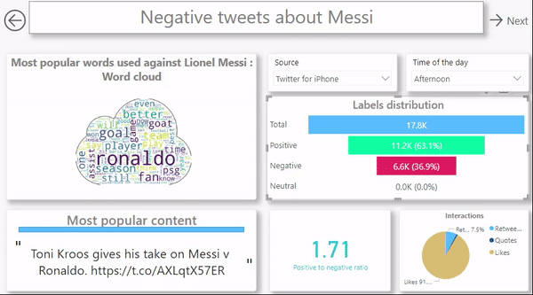

# Twitter-sentiment-analysis    

A sentiment analysis model trained using a Kaggle GPU. Sentiment140 Dataset, with 1.6 million tweets.  

> **Deployed on my personal Docker Hub repository: *Click here* [Click here](https://hub.docker.com/repository/docker/ibrahimserouis/my-tensorflow-models)

> **Kaggle Notebook link:  [Kaggle notebook](https://www.kaggle.com/ibrahimserouis99/twitter-sentiment-analysis)

# Dataset (Sentiment140+GloVe)

- Train/test split : 90% / 10% 
- Size : 1.6M samples 
- Link : [Dataset](https://www.kaggle.com/ibrahimserouis99/twitter-sentiment-analysis-and-word-embeddings)

# Model

- Model type : Sequential, RNN, Binary classification
- Optimizer : Adam
- Loss function : Binary cross entropy 
- Outputs : 0 or 1. **0 = negative, 1 = positive**
- Thresholds (fine-tuned):  >=0.644 ---> "Positive", <0.6 ----> "Negative", and the values in-between are equivalent to "Neutral".
- Best validation accuracy : 83.10%
- Best f1-score :  0.8351
- Version : 3

# Training 

- Training epochs : **initially** 50, but 18 with early stopping and a patience factor = 10
- Training environment : Kaggle GPU

## Architecture

# Inferences (with Tensorflow Serving REST API)

# Some results using Power BI

## Positive tweets

## Negative tweets 

## Data by country (when available)

# Useful scripts and notebooks

## Notebooks 

> [Link to the training notebook](Notebook/twitter-sentiment-analysis.ipynb)

> [Link to the data cleaning notebook](Notebook/data-cleaning-messi-and-ronaldo-tweets.ipynb)

## Scripts

> [Link to the Tensorflow Sevring script](Scripts/test_the_model.py)

> **There's also a useful script (command line runner) that converts .h5 models to TF SavedModel format [here](Scripts/h5_to_savedmodel.py)
> 

# Data collection (tweets about Messi and Ronaldo)

- Collected using the Twitter API 
- Scripts for searching and saving 10.000*n tweets containing a keyword : [Tweets about Messi](Scripts/search_n_times_100_messi_tweets.py) & [Tweets about Ronaldo](Scripts/search_n_times_100_ronaldo_tweets.py)

> **NOTE: Executing these scripts requires a developer account, as well as a bearer_token stored into a text file whose path is manually given into the code, or exported as an environment variable**

# Libraries

- Deep Learning Framework : Tensorflow 2.0 or higher 
- Data visualization : Pandas, seaborn, matplotlib
- Regular expressions builder : re 
- NLP library : NLTK, with stopwords
- Train/test splitting, classification_report : Scikit-learn
